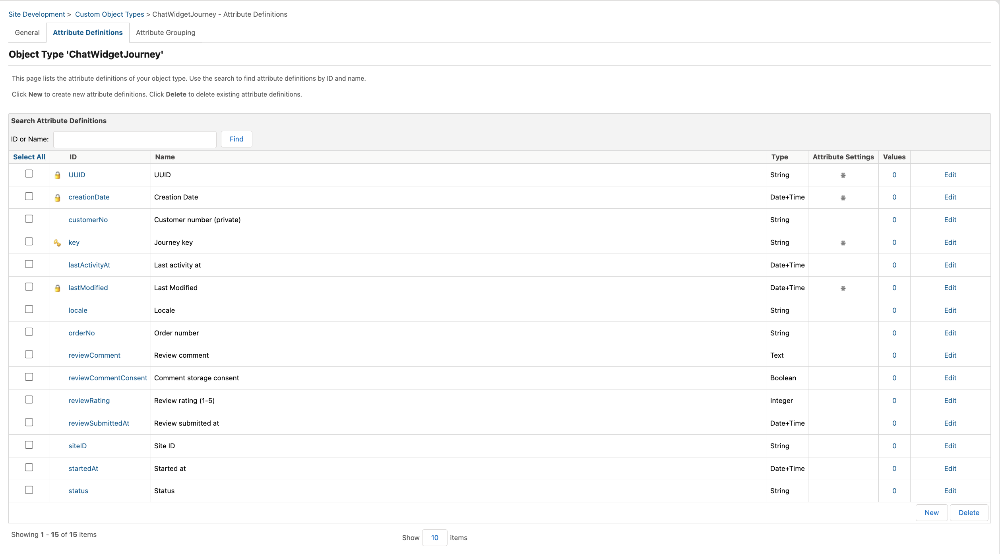
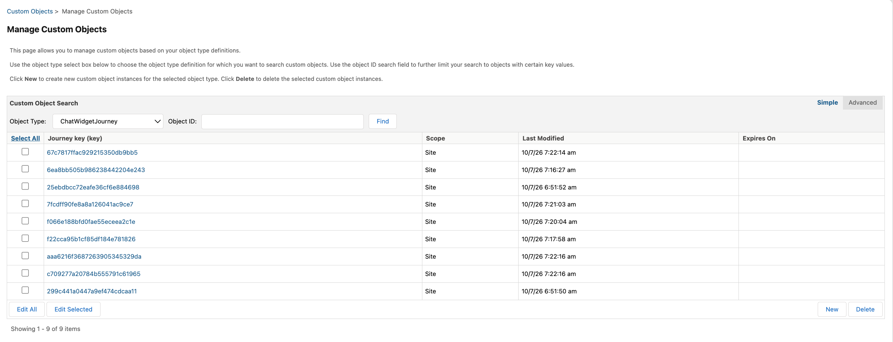
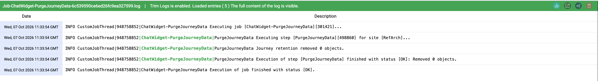

# Merchant guide

[← README](../README.md) · [Installation](INSTALLATION.md) · [Troubleshooting](TROUBLESHOOTING.md)

What the assistant stores, where to read it in Business Manager, and how retention and erasure work. Screenshots were supplied by the author from sandbox `zyeu-002`.

## What is recorded

Each browser-session journey is one `ChatWidgetJourney`. Every widget action appends a `ChatWidgetActivity` with an `action` (for example `catalog_viewed`, `add_to_cart`, `checkout_step_entered`, `order_placed`, `review_submitted`), a `result` (`success`, `error`, `redirect`), a non-sensitive `entityID` (category, product, order number) and short `context` (for example `step=payment`, `results=12`).

| Journey status | Meaning |
| --- | --- |
| `active` | Shopper is using the widget |
| `ordered` | An order was placed or confirmed in this journey |
| `reviewed` | The order was reviewed; the next order starts a new journey |
| `closed` | The shopper signed out |

Nothing is recorded when the shopper has not accepted tracking. Reviews are always stored because submitting one is an explicit action. Comments are stored only with the consent checkbox.

## Custom object types

**Administration > Site Development > Custom Object Types**

## Journeys and reviews

**Merchant Tools > Custom Objects > Manage Custom Objects > ChatWidgetJourney**

The journey for order 00000102: status `reviewed`, rating 5, comment stored with consent.

## Activity trail

**Merchant Tools > Custom Objects > Manage Custom Objects > ChatWidgetActivity**

To follow one journey, search activities by `custom.journeyKey` in the Advanced search.

## Retention job

**Administration > Operations > Jobs > ChatWidget-PurgeJourneyData**

These runs used the job's original `site-id` of `RefArch`, so they cleaned up
an empty site and removed nothing. Set `site-id` to the storefront site before importing.

| Parameter | Default | Effect |
| --- | --- | --- |
| `ActivityRetentionDays` | 90 | Deletes activities older than this |
| `JourneyRetentionDays` | 365 | Deletes journeys (and their reviews) inactive for longer than this |
| `CustomerNo` | empty | Erases that customer's journeys and activities, including guest activity recorded earlier in the same journeys |

## Data-subject requests

To erase one customer, edit the job step, set `CustomerNo` to the customer number shown on their journeys, and click **Run Now**. Clear the parameter afterwards.

## Reviews

Reviews live on the journey: `reviewRating` (1–5), `reviewComment`, `reviewCommentConsent` and `reviewSubmittedAt`, with the order in `orderNo`. Find reviewed journeys with the Advanced search `custom.status = reviewed`.
