# Shopper guide

[← README](../README.md) · [Merchant guide](MERCHANT-GUIDE.md) · [Architecture](ARCHITECTURE.md)

Every screen and outcome of the assistant, captured on sandbox `zyeu-002`, site `RefArch_Practice`, on October 7, 2026, with headless Chrome.

### 1. Launcher and start menu

The widget opens automatically once per browser session and can be reopened from the launcher.

| Closed | Guest menu | Signed-in menu |
| --- | --- | --- |
|  | 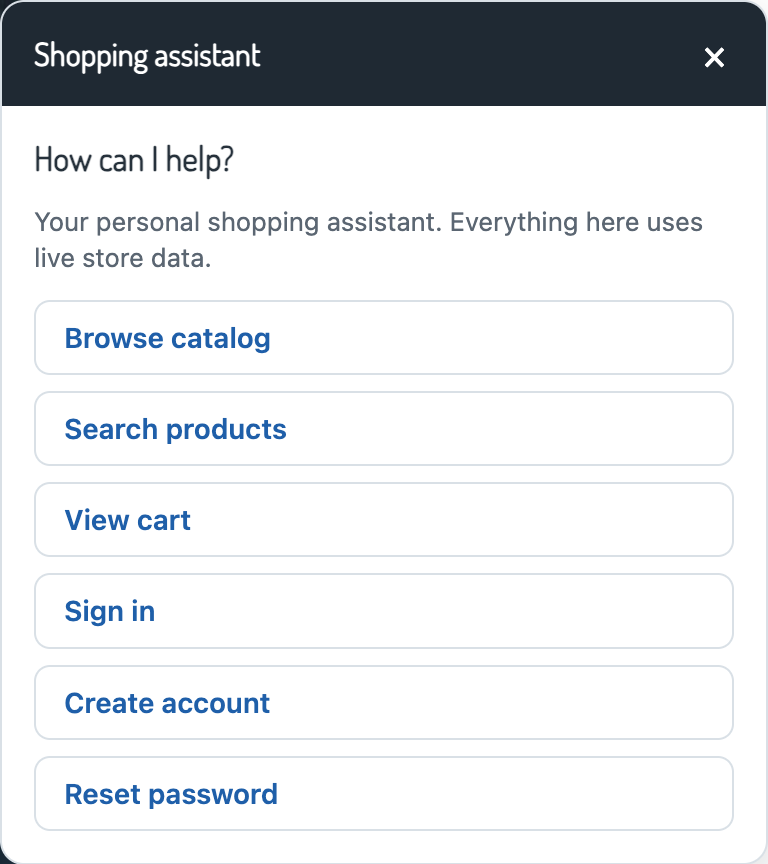 | 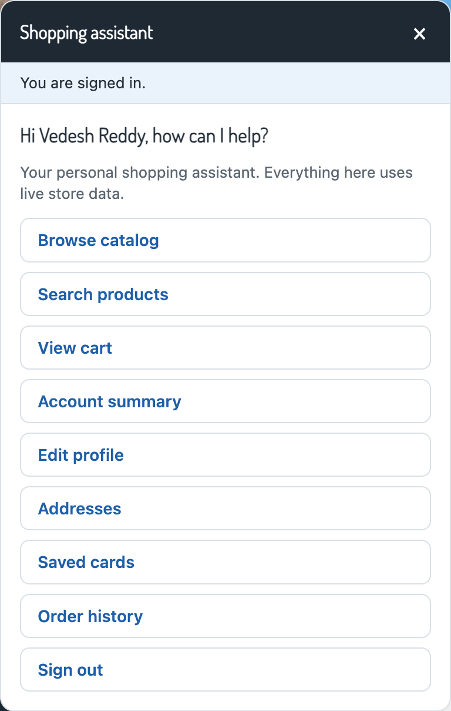 |

<strong>Mobile</strong>

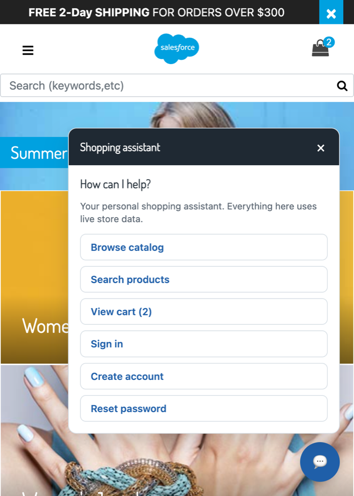

### 2. Browse and search

| Categories | Subcategories | Product carousel |
| --- | --- | --- |
| 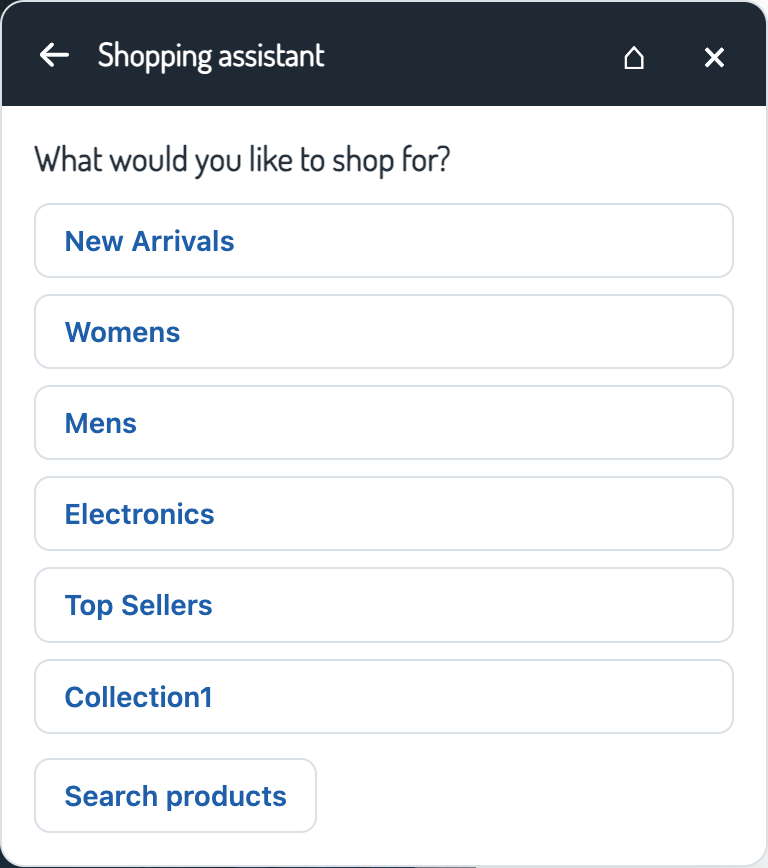 |  |  |

| Search | Results | No results |
| --- | --- | --- |
|  |  |  |

### 3. Choose options and add to cart

| Options | Ready to add | Added |
| --- | --- | --- |
|  | 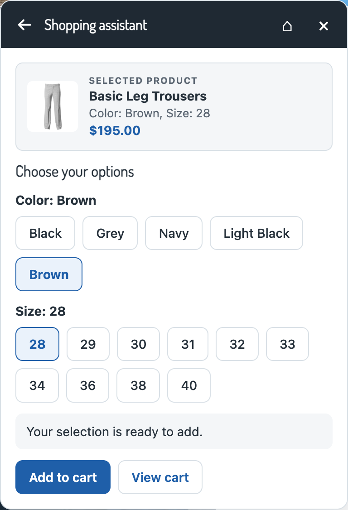 |  |

### 4. Cart and promotions

| Cart | Quantity updated | Promo code rejected |
| --- | --- | --- |
| 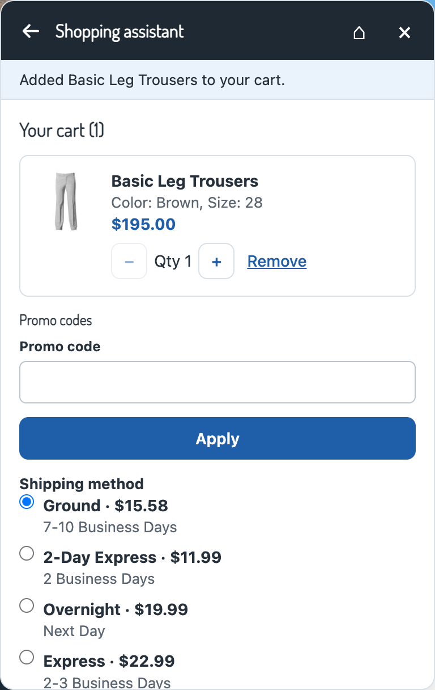 |  | 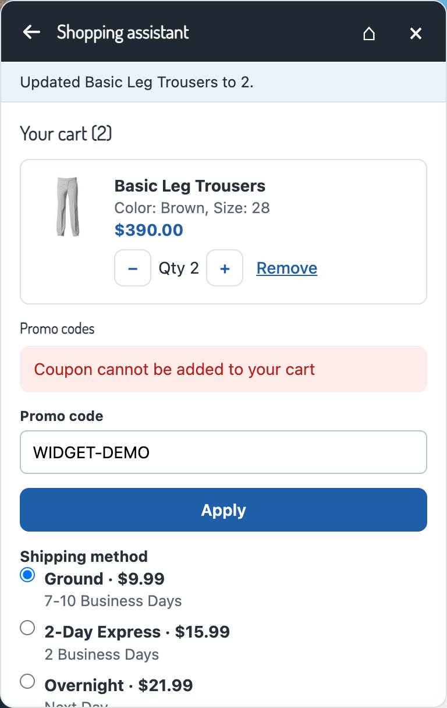 |

| Promotions (none active) | Guest checkout |
| --- | --- |
| 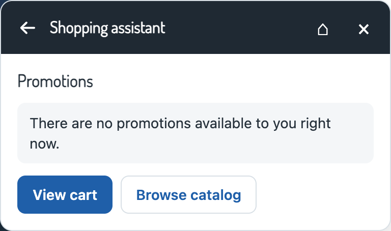 |  |

### 5. Sign in, register, reset password

| Sign in | Wrong credentials | Registration error |
| --- | --- | --- |
|  | 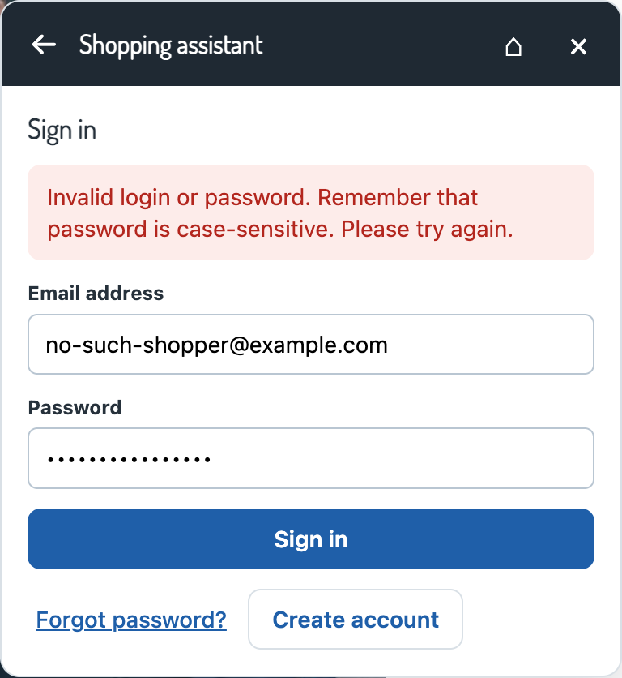 |  |

| Reset password | Reset requested |
| --- | --- |
| 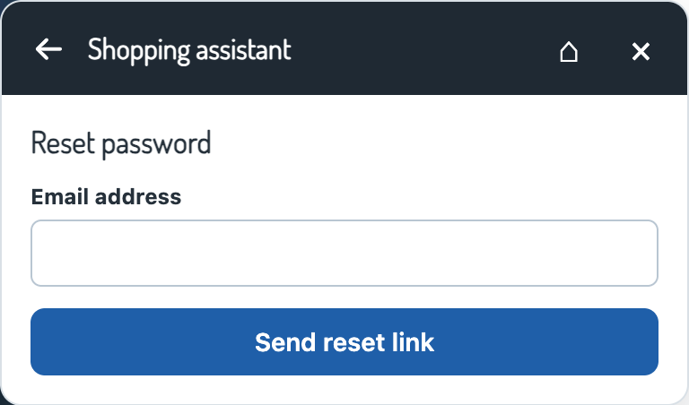 |  |

The reset response is the same whether or not the account exists, so the widget cannot be used to discover accounts.

### 6. Account

| Summary | Edit profile |
| --- | --- |
| 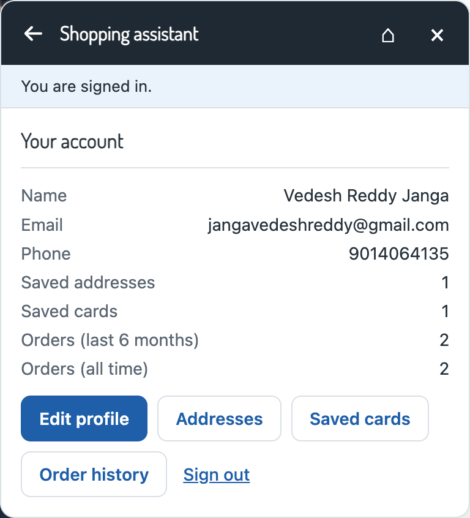 |  |

| Addresses | Add address | Added |
| --- | --- | --- |
|  |  |  |

| Delete prompt | Deleted |
| --- | --- |
|  |  |

| Saved cards | Order history | Order details |
| --- | --- | --- |
|  | 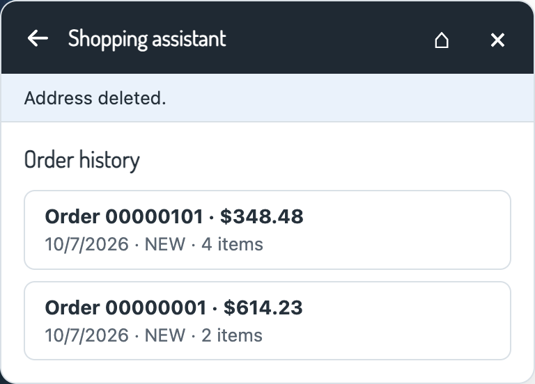 | 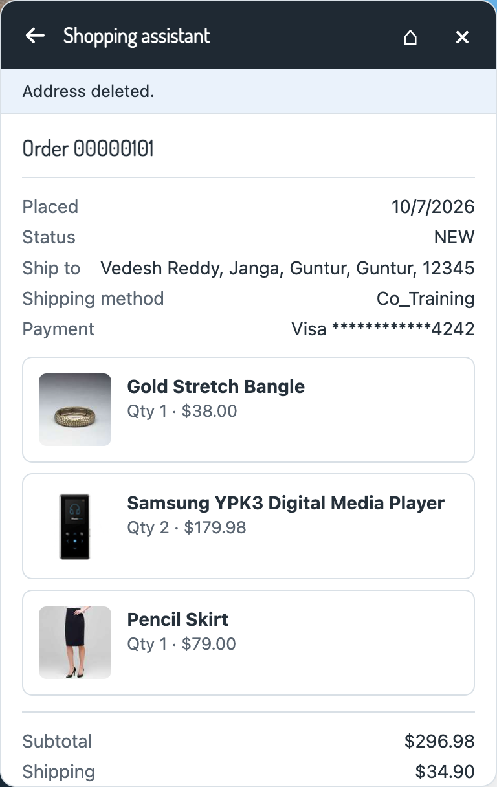 |

### 7. Checkout in the widget

| Delivery address | Shipping method | Payment |
| --- | --- | --- |
|  |  |  |

| Review | Placed, with review form |
| --- | --- |
| 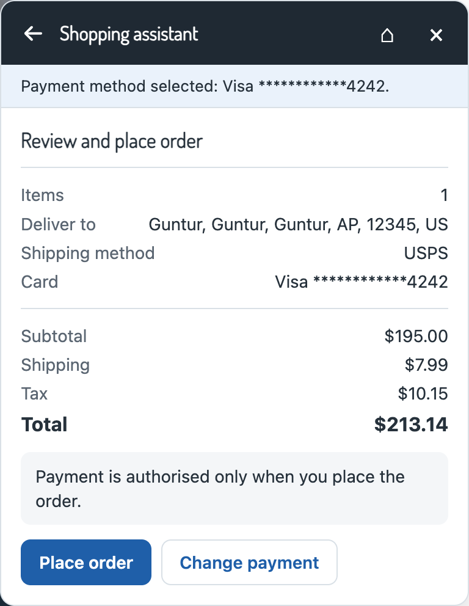 |  |

The security code goes only to `CheckoutServices-SubmitPayment` and is never stored.
The store's standard confirmation email follows:

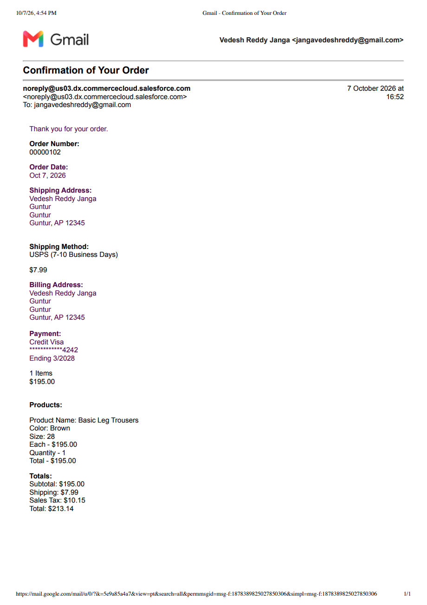

### 8. Review the order and sign out

| Comment without consent | Review saved | Signed out |
| --- | --- | --- |
|  |  |  |

